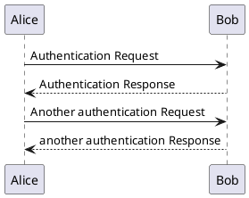

# 比较

## Docute提供的比较：

https://docute.org/zh/

VuePress / GitBook / Hexo

这些项目在构建时会生成静态的 HTML，这对 SEO 非常有帮助。

如果你在意 SEO，那你可能会喜欢使用 presite

来预渲染你的网站。

Docsify

和 Docute 几乎相同，但具有不同的 UI 和不同的使用方式。

Docute（60kB）比 Docisfy（20kB）大 3 倍，因为我们使用了 Vue，Vue Router 和 Vuex，而 Docsify 使用的是 vanilla JavaScript。

## VuePress：为什么不是...?

Nuxt

VuePress 能做的事情，Nuxt 理论上确实能够胜任，但 Nuxt 是为构建应用程序而生的，而 VuePress 则专注在以内容为中心的静态网站上，同时提供了一些为技术文档定制的开箱即用的特性。

Docsify / Docute

这两个项目同样都是基于 Vue，然而它们都是完全的运行时驱动，因此对 SEO 不够友好。如果你并不关注 SEO，同时也不想安装大量依赖，它们仍然是非常好的选择！

Hexo

Hexo 一直驱动着 Vue 的文档 —— 事实上，在把我们的主站从 Hexo 迁移到 VuePress 之前，我们可能还有很长的路要走。Hexo 最大的问题在于他的主题系统太过于静态以及过度地依赖纯字符串，而我们十分希望能够好好地利用 Vue 来处理我们的布局和交互，同时，Hexo 的 Markdown 渲染的配置也不是最灵活的。

GitBook

我们的子项目文档一直都在使用 GitBook。GitBook 最大的问题在于当文件很多时，每次编辑后的重新加载时间长得令人无法忍受。它的默认主题导航结构也比较有限制性，并且，主题系统也不是 Vue 驱动的。GitBook 背后的团队如今也更专注于将其打造为一个商业产品而不是开源工具。

## 制作在线和离线帮助文档（使用手册），用什么工具比较好？

https://www.zhihu.com/question/20233548

Docsify 是一个神奇的文档站点生成器。它很好地完成了文档生成的任务。重要的是，它可以动态地呈现你的文档，这意味着你无需将 MD 解析为 HTML — 只需要将你的文件放在正确的位置即可！除此以外，Docsify 有大量插件和一些主题可供选择。它也有很好的文档记录（就像文档生成器一样）。当我自己项目的文档使用这个工具时，我可能会有些偏见。它唯一的问题是（至少对我来说）与 IE 10（正如其在主页上所说）的兼容性不是很好（但是他们正在尝试进行兼容），而且它对相关链接缺少必要的支持。

Docute v4 文档  Docute 是一个类似于 Docsify 的工具，但它有一个可爱的名字。最新的版本（v4）相比上一个版本要少一些文档，同时也进行了一定程度的简化。生成的文档看起来简约而优雅。可以使用 CSS 变量 定制主题。Docute 不像 Docsify 那样拥有强大的插件系统，但它有着自己的优势。它建立在 Vue.js 之上，这导致包的大小相比于 Docsify 要大些，但扩展性好了很多。比如，在你的 MD 文件中，你可以使用一些内置的 Vue 组件，甚至你自己的组件。

Slate 文档  Slate 可能是在 GitHub 上记录你的项目以及小星星数量的领头羊（~25,000）。它的文档清晰，语法可读性好，且有 everything-on-one-page 的特点。还具有非常可靠的 GH wiki 文档。它允许深度主题化 ，但因为文档提供的信息不多，所以你需要自己去源码挖掘。遗憾的是，它的可扩展性很差，但胜在功能丰富，对于那些需要 REST API 文档的人来说，这似乎是一个不错的选择。请记住，Slate 生成的是静态 HTML 文件，而不是在运行中动态生成文件。

Docusaurus 是一个易于维护开源文档生成网站的工具。它是由 Facebook 创建的，使用的是 — 没错，就是它 — React。它可以将 React 组件和库轻松地转换或集成为一个整体来创建自定义页面。无需其他工具，它还可以建立额外的 blog 直接整合到你的文档网站，甚至无需其他工具！它可以与 Algolia DocSearch 很好地集成，使你的文档易于导航。就像 Slate 一样，它会生成静态 HTML 文件。

VuePress 是一个 Vue 驱动的静态站点生成器，由 Vue.js 的创始人开发。这也是生成 Vue.js 官方文档的可靠工具。作为一个生成器，它有非常友好的文档。它还具有一个强大的插件和主题系统，当然也继承了优秀的 Vue.js。uePress 宣称其对 SEO 友好，这是因为它生成并输出的是 HTML 文件。

GitBook 是用于编写 MD 文档和文本的工具。它为你提供了一个在线编辑器和免费 .http://gitbook.io 域名体验。毫无疑问，在线编辑器很棒，但是涉及到布局，它并没有太多的可定制性。该编辑器还有它的遗留桌面版本。但除非你是在做一个开源的项目，否则你需要为此付费。

有哪些好用的文档生成工具, 以及为什么好？

https://www.zhihu.com/question/20192898/answer/785552198


# Vuepress

# docsify

https://docsify.js.org

基本操作：

* npm i docsify-cli -g
* docsify init ./docs
* docsify serve docs
*

## plantuml 支持

https://github.com/imyelo/docsify-plantuml

### Install

    Configure docsify-plantuml (optional):

    <script>
    window.$docsify = {
      plantuml: {
        skin: 'default',
      },
    }
    </script>

    See Options for more details.

    Insert script into docsify document:

    <script src="//unpkg.com/docsify-plantuml/dist/docsify-plantuml.min.js"></script>

### Usage

Write your plantuml code into a code block marked plantuml:



## 转PDF 支持

https://github.com/meff34/docsify-to-pdf-converter

## Docsify PDF Embed Plugin

A simple plugin for embedding PDF in Docsify with the use of PDFObject.js

https://github.com/lazypanda10117/docsify-pdf-embed

## awesome-docsify

A curated list of awesome things related to docsify

https://github.com/docsifyjs/awesome-docsify

## sideBar(TOC)

https://docsify.js.org/#/more-pages?id=table-of-contents

自动生成目录:

When subMaxLevel is set, each header is automatically added to the table of contents by default. If you want to ignore a specific header, add {docsify-ignore} to it.

当设置了　subMaxLevel 的值，文档的标题将自动添加到TOC。

默认文档：

在文件夹中放置README.md文档，在sidebar.md中可直接使用“路径”，不指定文件名时，默认指向README.md文档。
如：

``` - [文档工具](/doc_tools/) ```

默认文档可以使用homepade标签修改，如修改为 index.md

```
<script>
  window.$docsify = {
    ...
    homepage: 'index.md'
    ...
  }
</script>
```

### 样式

```
<!-- <link rel="stylesheet" href="//unpkg.com/docsify/lib/themes/vue.css"> -->
<link rel="stylesheet" href="assets/css/theme-simple.css" title="Simple">
<link rel="stylesheet" href="assets/css/main.css">
```

### 搜索框

```
<script>
  window.$docsify = {
    ...
    search: {
          depth      : 3,
          noData     : 'No results!',
          placeholder: 'Search...'
    }
  }
</script>

<script src="https://cdn.jsdelivr.net/npm/docsify@4/lib/plugins/search.js"></script>
```

### Nested Sidebars

https://docsify.js.org/#/more-pages?id=sidebar

You may want the sidebar to update with only navigation to reflect the current directory. This can be done by adding a _sidebar.md file to each folder.

_sidebar.md is loaded from each level directory. If the current directory doesn't have _sidebar.md, it will fall back to the parent directory. If, for example, the current path is /guide/quick-start, the _sidebar.md will be loaded from /guide/_sidebar.md.

You can specify alias to avoid unnecessary fallback.

```
<script>
  window.$docsify = {
    loadSidebar: true,
    alias: {
      '/.*/_sidebar.md': '/_sidebar.md'
    }
  }
</script>
```

You can create a README.md file in a subdirectory to use it as the landing page for the route.


# Docute

## 什么是 Docute ？

Docute 本质上就是一个 JavaScript 文件，它可以获取 Markdown 文件并将它们呈现为单页面应用。

它完全由运行时驱动，因此并不涉及服务端组件，这就意味着没有构建过程。你只需创建一个 HTML 文件和一堆 Markdown 文档，你的网站就差不多完成了！

https://docute.org/

可以使用以下命令将此文件夹作为计算机上的静态网站展示：

Node.js: npm i -g serve && serve .
Python: python -m SimpleHTTPServer
Golang: caddy
..或任何静态 web 服务器
