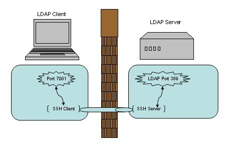

# 端口转发-隧道

https://www.ibm.com/developerworks/cn/linux/l-cn-sshforward/index.html

## 本地转发

```
ssh -L <local port>:<remote host>:<remote port> <SSH hostname>
```

我们先来看第一个例子，在实验室里有一台 LDAP 服务器（LdapServerHost），但是限制了只有本机上部署的应用才能直接连接此 LDAP 服务器。如果我们由于调试或者测试的需要想临时从远程机器（LdapClientHost）直接连接到这个 LDAP 服务器 , 有什么方法能够实现呢？

答案无疑是本地端口转发了，它的命令格式是：

ssh -L <local port>:<remote host>:<remote port> <SSH hostname>

在 LdapClientHost 上执行如下命令即可建立一个 SSH 的本地端口转发，例如：

$ ssh -L 7001:localhost:389 LdapServerHost



## 远程转发

```
ssh -R <local port>:<remote host>:<remote port> <SSH hostname>
```

远程转发实例分析

我们来看第二个例子，这次假设由于网络或防火墙的原因我们不能用 SSH 直接从 LdapClientHost 连接到 LDAP 服务器（LdapServertHost），但是反向连接却是被允许的。那此时我们的选择自然就是远程端口转发了。

它的命令格式是：

ssh -R <local port>:<remote host>:<remote port> <SSH hostname>

例如在 LDAP 服务器（LdapServertHost）端执行如下命令：

$ ssh -R 7001:localhost:389 LdapClientHost


